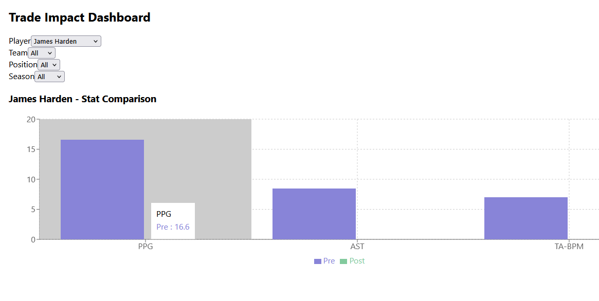

# 🏀 JusDoIt

An interactive full-stack web app that visualizes NBA players’ performance **before and after being traded**.

## 📊 Features

- Filter by player, team, season, and position
- Compare pre- and post-trade stats: PPG, AST, TA-BPM
- Clean data visualization with **Recharts**
- Backend powered by **Flask + Pandas**
- Frontend built in **React + Tailwind CSS**

## 📸 Screenshots

> 

## 🚀 Tech Stack

- **Frontend**: React, Tailwind CSS, Recharts
- **Backend**: Python, Flask, Pandas
- **Data**: CSV data processed with trade labels
- **Tools**: Git, VS Code, Node, pip

## 🛠 Local Setup

1. **Clone the repo**  
   ```bash
   git clone 
   cd 'your project'
   cd backend
	pip install -r requirements.txt
	python server.py
	cd react-frontend
	npm install
	npm start

JusDoIt-dashboard/
│
├── backend/
│   ├── server.py
│   ├── data/processed/with_bpm.csv
│   └── ...
│
├── react-frontend/
│   ├── src/
│   │   ├── pages/PlayerDashboard.jsx
│   │   ├── components/StatCard.jsx
│   │   └── ...
│   └── public/
│
├── .gitignore
└── README.md


